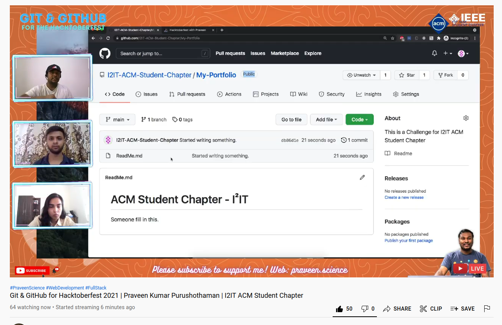

# ACM Student Chapter - I²IT

Welcome to the Official Github of ACM Student Chapter - I²IT

I would like to give a chance to the first student of I²IT, who gives a nice intro text here, will be receiving a domain name for free from me.

Let me introduce you to ACM-I²IT student chapter!

ACM aka Association for Computer Machinery is the world's largest scientific and educational computing soceity. ACM's IsquareIT student chapter in our college is established and is flourishing over the years. We here at ACM IsquareIT work to provide the best technical resources, support and exposure to our college students through various events, activites, webinars and competitions.Now we are mentoring students for Hacktoberfest'21..

---

## Connect with us:

- [Instagram](https://instagram.com/i2itacm)
- [GitHub](https://github.com/I2IT-ACM-Student-Chapter/)

---

## [Watch Stream Here](https://rb.gy/uigohf)
